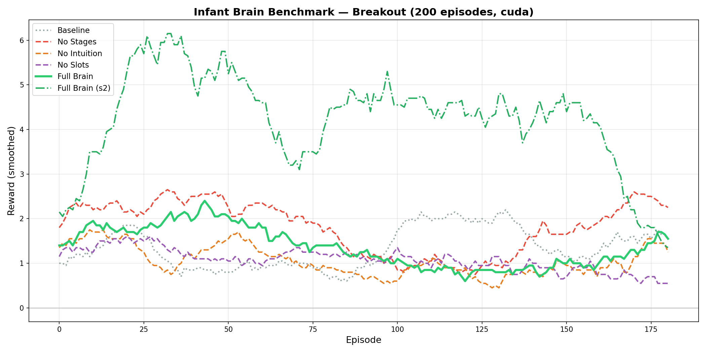

# Infant Brain

A self-learning AI that grows like a child. Seven neural modules work together to learn physics, language, and reasoning from raw pixels — no labels, no rewards, no pre-training.

## Architecture


| #   | Module             | What it does                                  |
| --- | ------------------ | --------------------------------------------- |
| 1   | **World Model**    | Learns physics from pixels (JEPA + SIGReg)    |
| 2   | **Curiosity**      | Explores what's surprising                    |
| 3   | **Metacognition**  | Knows what it knows and doesn't know          |
| 4   | **Language**       | Grounds words in visual experience            |
| 5   | **Values**         | Internal feedback signals guide learning      |
| 6   | **Memory + Sleep** | Stores experiences, consolidates during sleep |
| 7   | **Reasoning**      | Plans multi-step actions with GRPO            |


## Quick Start

```bash
# Install from PyPI (core package)
pip install infant-brain

# Optional extras
pip install "infant-brain[atari]"     # Atari environment support
pip install "infant-brain[plotting]"  # matplotlib plotting tools
pip install "infant-brain[all]"       # everything

# Local development install
pip install -e ".[dev,all]"

# Train on GridWorld (no GPU needed)
python scripts/train.py --env gridworld --episodes 1000

# Train on Atari Pong
python scripts/train.py --env atari --game Pong --episodes 2000

# Evaluate
python scripts/evaluate.py --checkpoint checkpoints/brain_pong.pt --env atari --game Pong
```

## PyPI Release

```bash
python -m pip install -U build twine
python -m build
python -m twine check dist/*
# Upload when ready:
# python -m twine upload dist/*
```

## First Shippable Wrapper (Support Triage)

This project now includes a non-game wrapper that demonstrates a real workflow:
support-ticket triage with safe action execution.

```bash
# Train + run in dry-run mode (default)
python scripts/support_ticket_demo.py --episodes 40

# Allow action execution path (still simulated; place real API calls in SafeTicketExecutor)
python scripts/support_ticket_demo.py --episodes 40 --execute

# Print each ticket’s text before the action (human-readable demo; model still uses structured fields unless you add embeddings)
python scripts/support_ticket_demo.py --episodes 40 -v
```

What this wrapper includes:
- `SupportTicketEnv`: Brain-compatible environment for ticket states/actions.
- `SafeTicketExecutor`: Safety rails (allowlist + escalation guard + dry-run default).
- `support_ticket_demo.py`: End-to-end training + deterministic triage run.

## Webcam / video streaming (prototype)

Pipe a **camera or video file** through the brain and read **discrete actions** each frame (you map actions to real behavior: ROS topics, UI, recording, etc.).

```bash
pip install -e ".[streaming]"   # adds opencv-python-headless

# Webcam: inference only (no training), print actions
python scripts/stream_act_demo.py --camera 0 --frames 120 --no-train

# Video file: short online training (motion-based reward), then walk the clip
python scripts/stream_act_demo.py --video /path/to/clip.mp4 --episodes 15 --frames 200
```

- Observations are resized to **32×32 (CPU)** or **64×64 (CUDA)** to match the world model.
- `ACTION_HINTS` in `scripts/stream_act_demo.py` is where you label behaviors for your demo.

## GPU Training

### 1. Rent a GPU


| Provider                              | Cost      | Recommended |
| ------------------------------------- | --------- | ----------- |
| [Lambda Labs](https://lambdalabs.com) | ~$1.10/hr | A10 or A100 |
| [Vast.ai](https://vast.ai)            | ~$0.30/hr | RTX 3090    |
| [RunPod](https://runpod.io)           | ~$0.40/hr | RTX 4090    |


### 2. Setup

```bash
git clone <your-repo> infant-brain && cd infant-brain
bash scripts/setup_gpu.sh
```

### 3. Train

```bash
# Single game (5K episodes, ~30 min on A100)
python scripts/train.py --env atari --game Pong --episodes 5000 --device cuda

# All 10 games (~5 hours on A100)
python scripts/train_all_games.py --device cuda --episodes 5000

# Scaled model (larger brain, longer training)
python scripts/train.py --config configs/gpu_full.yaml --device cuda
```

### 4. Expected GPU Results


| Game          | Episodes   | Expected Improvement | Time (A100) |
| ------------- | ---------- | -------------------- | ----------- |
| Pong          | 5,000      | 500-1000x            | ~30 min     |
| Breakout      | 5,000      | 300-500x             | ~30 min     |
| SpaceInvaders | 5,000      | 50-100x              | ~30 min     |
| MsPacman      | 5,000      | 200-400x             | ~35 min     |
| 10 games      | 5,000 each | varies               | ~5 hours    |

## Breakout Benchmark

This benchmark compares the complete system with ablations over 200 Breakout
episodes on CUDA. Each line is the smoothed episode reward; higher values mean
the agent collected more reward in the game.



The comparison is:

- **Full Brain**: all modules enabled.
- **Full Brain (s2)**: a second run of the complete system with a different
    seed.
- **Baseline**: the reference configuration.
- **No Stages**, **No Intuition**, and **No Slots**: ablations with one
    subsystem removed.

The JSON files containing the raw episode rewards are in
[`results/benchmark`](results/benchmark). The chart is descriptive evidence
from this run, not a guarantee of performance on every game or hardware setup.


## Using as a Library

```python
from infant_brain.brain import Brain
from infant_brain.envs import AtariEnv, GridWorldEnv

env = AtariEnv("Pong")              # or GridWorldEnv()
brain = Brain(env, device="auto")   # auto-detects GPU
brain.train(episodes=5000)
brain.save("checkpoints/pong.pt")

# Inference
words = brain.describe(frame)       # what does it see?
z = brain.encode(frame)             # latent representation
z_next = brain.predict(frame, 1)    # predict next state
```

## Custom Environments

```python
from infant_brain.envs.base import BrainEnv

class MyEnv(BrainEnv):
    def reset(self, seed=None) -> torch.Tensor:
        return frame  # (3, 64, 64) float [0,1]

    def step(self, action) -> tuple:
        return frame, reward, done

    @property
    def num_actions(self) -> int: return 4

    @property
    def vocab_words(self) -> list: return ["word1", "word2"]

    def close(self): pass
```

## Project Structure

```
infant-brain/
├── infant_brain/
│   ├── brain.py              # Main Brain class (all 7 modules)
│   ├── modules/              # 7 neural modules
│   │   ├── world_model.py    # JEPA encoder + predictor + SIGReg
│   │   ├── language.py       # Cross-modal word grounding
│   │   ├── metacognition.py  # Competence & learning progress
│   │   ├── value_system.py   # Internal feedback signals
│   │   ├── memory.py         # Episodic + semantic + sleep
│   │   ├── self_correction.py# Change detection + belief updates
│   │   ├── knowledge_tree.py # Concept hierarchy
│   │   └── reasoning.py      # Action planning
│   └── envs/                 # Environment wrappers
│       ├── base.py           # Abstract interface
│       ├── gridworld.py      # 2D grid world
│       └── atari.py          # Any Atari game
├── configs/                  # YAML configs
├── scripts/
│   ├── train.py              # Single-game training
│   ├── train_all_games.py    # Multi-game GPU training
│   ├── evaluate.py           # Evaluation
│   └── setup_gpu.sh          # Cloud GPU setup
└── checkpoints/              # Saved brains
```

## License

MIT