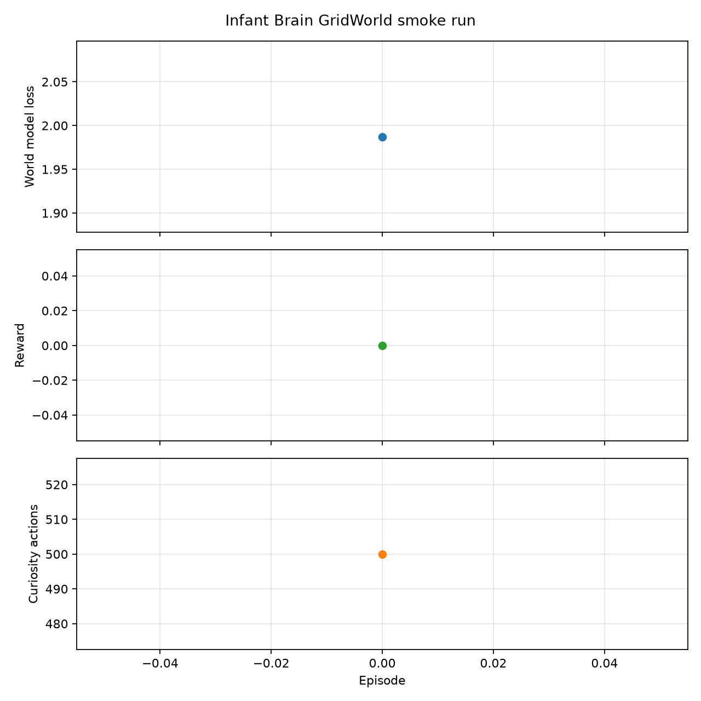

# Results

Place reproducible benchmark summaries, evaluation metrics, and figures here.

Keep large model checkpoints, virtual environments, caches, and temporary logs
out of this directory. Record the command, configuration, seed, device, and
software version alongside each result so others can reproduce it.

## GridWorld smoke run

The first CPU smoke run trained for one episode and produced the following
summary graph:

Raw metrics: [history_gridworld.json](smoke/history_gridworld.json)